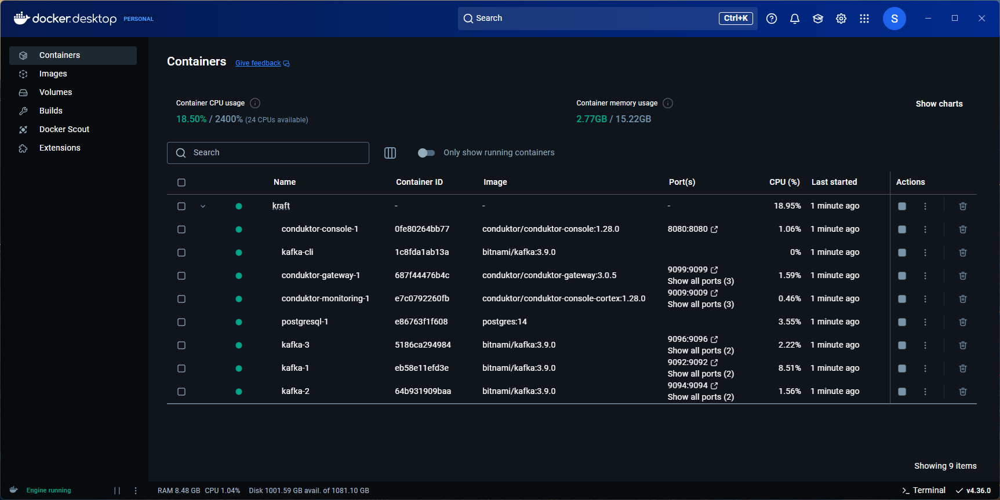
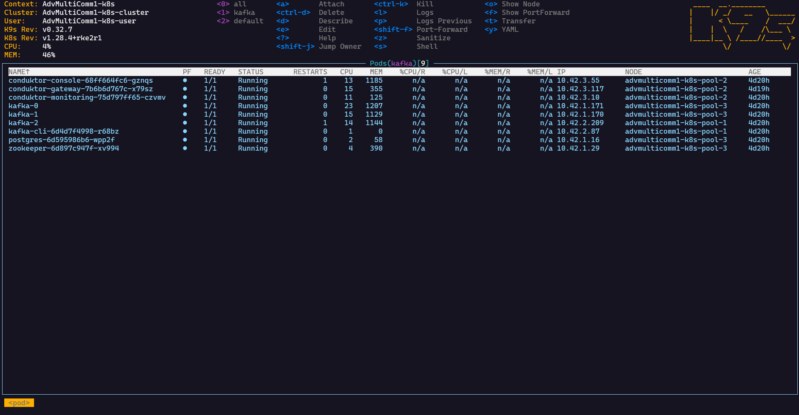

<center><h1>Installation von Apache Kafka</h1><span style="font-size: 12px;">
Lucas Immanuel Nickel und Lorenz Hohmann<br>
Masterseminar Wintersemester 2024/2025<br>
09.12.2024
</span></center>

## Einführung in Apache Kafka

Apache Kafka ist eine verteilte Streaming-Plattform für Ereignisse (Event-Streaming), die darauf ausgelegt ist, große Mengen an Echtzeitdaten zu verarbeiten. Sie ermöglicht Publish-Subscribe-Messaging, Speicherung und Verarbeitung von Datenströmen und ist damit essentiell für den Aufbau hochperformanter, latenzarmer Datenpipelines. Neben Kafka selbst gibt es verschiedene zusätzliche Tools und Komponenten — wie etwa Conduktor für Monitoring und Administration sowie CLI-Tools für Befehlszeilenoperationen — die das gesamte Kafka-Ökosystem ergänzen.

Diese Dokumentation stellt drei Hauptbetriebsmodi von Kafka-Clustern vor (ZooKeeper, KRaft und Redpanda), erläutert die Installation und Ausführung von Kafka sowohl lokal (mittels Docker) als auch in verteilten Umgebungen (mittels Kubernetes) und demonstriert grundlegende Befehle für die Arbeit mit Kafka-Themen, Produzenten und Konsumenten.

## Kafka-Modi und Architekturen

### ZooKeeper

Historisch nutzte Kafka ZooKeeper für die Cluster-Koordination und Metadatenverwaltung. ZooKeeper verwendet das ZAB-Protokoll (ZooKeeper Atomic Broadcast), um Konsistenz und Fehlertoleranz durch Leader-Wahlen sicherzustellen. Die Notwendigkeit zusätzlicher ZooKeeper-Instanzen erhöht jedoch den Ressourcenbedarf und kann die Skalierbarkeit einschränken. Zudem führt die zusätzliche Kommunikation zwischen den Brokern und ZooKeeper zu erhöhter Latenz.

In diesem Setup verwenden wir das Docker-Image `confluentinc/cp-kafka:7.7.1`. Diese Konfiguration wird zwar noch unterstützt, wird aber schrittweise durch modernere Implementierungen ohne ZooKeeper-Abhängigkeit abgelöst.

### KRaft

KRaft ist der native Kafka-Modus, der mit Kafka 2.8 eingeführt und ab Kafka 3.x zum Standard wurde. Er entfernt die externe Abhängigkeit von ZooKeeper, indem der Raft-Konsensalgorithmus direkt in Kafka integriert wird. Der Leader-Broker wickelt alle Schreiboperationen ab und repliziert die Änderungen an Follower-Knoten. Im Falle eines Leader-Ausfalls wird automatisch ein neuer Leader gewählt.

In unserem Beispiel verwenden wir das Docker-Image `bitnami/kafka:3.9.0`. Dieser Modus vereinfacht die Architektur und steigert Leistung sowie Skalierbarkeit.

### Redpanda

Redpanda ist eine mit Kafka kompatible Streaming-Plattform, die ebenfalls den Raft-Konsensalgorithmus einsetzt, jedoch in C++ implementiert ist. Dies ermöglicht eine effizientere Nutzung der Hardware und führt zu erheblich geringerer Latenz, was Redpanda insbesondere für Szenarien mit hohem Durchsatz attraktiv macht. Redpanda ist vollständig Kafka-kompatibel, sodass bestehende Kafka-Anwendungen ohne Code-Änderungen integriert werden können.

In unserer Umgebung verwenden wir das Docker-Image `redpandadata/redpanda:v24.2.10`.

## Lokale Installation mit Docker

Für lokale Tests und Entwicklungszwecke können Sie Kafka auf einem einzelnen Host mithilfe von Docker installieren und ausführen. Die bereitgestellten Docker-Compose-Templates ermöglichen das schnelle Aufsetzen einer minimalen Kafka-Umgebung (einschließlich der Conduktor-Weboberfläche, Gateway und eines CLI-Hosts) in nur wenigen Schritten.

### Voraussetzungen

- Installation von Docker Desktop gemäß [dieser Anleitung](https://docs.docker.com/desktop/).
- Sicherstellen, dass der Docker-Daemon läuft.

### Installationsschritte

1. **Repository klonen**:

   ```shell
   git clone https://github.com/lorenzhohmann/kafka-masterseminar-ws-2425.git
   cd kafka-masterseminar-ws-2425/docker/
   ```

2. **Template auswählen** (z. B. KRaft):

   ```shell
   cd KRaft
   ```

3. **Umgebung starten** mit:

   ```shell
   docker-compose up -d
   ```

   Zum Entfernen der Umgebung:

   ```shell
   docker-compose down -v
   ```

### Zugriff auf die Dienste

Nach dem Start der Umgebung stehen folgende Dienste zur Verfügung:

- **Conduktor Gateway:** `localhost:[9099 - 9101]`

- **Conduktor Console:** `http://localhost:8080` 

  Anmeldedaten: `admin@example.com` / `admin_password`

- **CLI Host:** Zugriff per `docker exec -it kafka-cli /bin/bash`

<div style="page-break-after: always;"></div>

### Dienste in Docker Desktop

Das folgende Bild zeigt beispielhaft die bereitgestellten Dienste für die KRaft-Installation:

<p align="center">
  
</p>

## Verteilte Installation mit Kubernetes

Für eine produktive, hochverfügbare Kafka-Umgebung wird der Einsatz von Kubernetes empfohlen. Wir haben ein Helm-Chart entwickelt, das die Kafka-Installation vereinfacht. Diese Vorgehensweise bietet Self-Healing, Reconciliation Loops und Multi-Host-Support.

### Voraussetzungen

- Grundkenntnisse in Kubernetes
- [Minikube](https://minikube.sigs.k8s.io/docs/start/) für lokale Tests
- [k9s](https://k9scli.io/) für Cluster-Management

### Installation des Helm-Charts

Zum Installieren des Helm-Charts führen Sie aus:

```bash
helm upgrade --install kafka-cluster . --namespace kafka --create-namespace
```

Zum Entfernen:

```bash
helm uninstall kafka-cluster --namespace kafka
```

<div style="page-break-after: always;"></div>

### Zugriff auf Dienste

Dienste werden als LoadBalancer bereitgestellt. In Minikube können Sie mithilfe von [Port Forwarding](https://kubernetes.io/docs/tasks/access-application-cluster/port-forward-access-application-cluster/) lokal darauf zugreifen:

- **Conduktor Gateway:**  
  `LoadBalancerIP:[9099-9101]`  
  Abruf der LoadBalancer IP:

  ```bash
  kubectl describe services conduktor-gateway -n kafka
  ```

  Fügen Sie anschließend `LoadBalancerIP conduktor-gateway` zu Ihrer Hosts-Datei hinzu.

  Oder in k9s zum Namespace `:pods kafka` navigieren, den `conduktor-gateway` Pod auswählen und mit `SHIFT + F` einen Port Forward anlegen.
  
- **Conduktor Console:**  
  `http://LoadBalancerIP:8080` Anmeldedaten: `admin@example.com` / `admin_password`)
  
  Abruf der LoadBalancer IP:
  
  ```bash
  kubectl describe services conduktor-console -n kafka
  ```
  
  Oder in k9s zum Namespace `:pods kafka` navigieren, den `conduktor-console` Pod auswählen und mit `SHIFT + F` einen Port Forward anlegen.
  
- **CLI Host:**  
  In k9s zum Namespace `:pods kafka` navigieren, den `kafka-cli` Pod auswählen und mit `s` eine Shell öffnen.

### Dienste in Kubernetes

Das folgende Bild zeigt die bereitgestellten Dienste in Kubernetes:

<p align="center">
  
</p>

### StatefulSets und Headless Services

Das Helm-Chart konfiguriert Kafka als `StatefulSet`, um stabile Identitäten und persistente Volumes für jeden Broker bereitzustellen. Ein `Headless Service` gewährleistet eine stabile Netzwerk-Identität für Broker innerhalb des Clusters und erleichtert deren Kommunikation.

### Vorteile der Kubernetes-Installation

- **Self-Healing:** Kubernetes startet Pods bei Ausfällen automatisch neu.
- **Reconciliation Loop:** Kubernetes sorgt kontinuierlich dafür, dass der Ist-Zustand dem Soll-Zustand entspricht, was Zuverlässigkeit und Konsistenz erhöht.
- **Multi-Host-Support:** Kubernetes verteilt Workloads automatisch auf mehrere Hosts und verbessert dadurch Skalierbarkeit und Fehlertoleranz. Hierfür nutzen wir [Pod-Anti-Affinity](https://kubernetes.io/docs/concepts/scheduling-eviction/assign-pod-node/#affinity-and-anti-affinity).

## Kafka CLI-Operationen

Die folgenden Befehle veranschaulichen grundlegende Operationen für Topics, Produzenten und Konsumenten. Die Beispielbefehle gehen von `kafka1:9092` als Bootstrap-Server aus. Passen Sie den Hostnamen bei Bedarf an.

### Topics

**Topic erstellen:**

```bash
kafka-topics --create --topic test-topic --bootstrap-server kafka1:9092 --partitions 3 --replication-factor 3
```

**Topics auflisten:**

```bash
kafka-topics --list --bootstrap-server kafka1:9092
```

**Topic löschen:**

```bash
kafka-topics --delete --topic test-topic --bootstrap-server kafka1:9092
```

### Producer

**Producer starten:**

```bash
kafka-console-producer --topic test-topic --bootstrap-server kafka1:9092
```

Geben Sie Nachrichten zeilenweise ein; jede Zeile wird als separate Nachricht gesendet.

**Producer mit Keys:**

```bash
echo "key:message" | kafka-console-producer --topic test-topic --bootstrap-server kafka1:9092 --property "parse.key=true" --property "key.separator=:"
```

### Consumer

**Consumer starten:**

```bash
kafka-console-consumer --topic test-topic --bootstrap-server kafka1:9092 --from-beginning
```

**Consumer-Gruppen:**

```bash
kafka-console-consumer --topic test-topic --bootstrap-server kafka1:9092 --group my-consumer-group --from-beginning
```

**Consumer Offsets überprüfen:**

```bash
kafka-consumer-groups --bootstrap-server kafka1:9092 --describe --group my-consumer-group
```

## Zusammenfassung

Diese Dokumentation bietet einen Überblick über drei Kafka-Architekturen — ZooKeeper, KRaft und Redpanda — und zeigt, wie man Kafka lokal (über Docker) oder in verteilten Umgebungen (über Kubernetes) installiert und ausführt. Zudem wurden grundlegende Kafka-CLI-Befehle für das Verwalten von Topics sowie das Produzieren und Konsumieren von Nachrichten vorgestellt. Durch die Nutzung von Kubernetes für produktive Umgebungen profitieren Sie von Skalierbarkeit, Fehlertoleranz und vereinfachtem Betrieb, während Docker eine unkomplizierte lokale Entwicklungsumgebung ermöglicht.